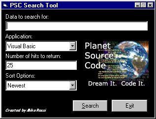



## PSC Search Tool

### Description

This application was developed as being a simple way to perform searches on PSC without having to go to their page first. I just threw this together real quick, but there shouldn't be any bugs. You can changed the criteria I use most often (Application, Number of hits to return, and Sort By) and you can put quotes (") around a phrase to search for that exact phrase.

I know that there are other apps like this on Planet Source Code, so if you like this one vote for it. If you want me to include other search options (Zip files only, articles only, Beginner, Advanced only) leave me some feedback and let me know.
 
### More Info
 

             |
---                |---
**Submitted On**   |2001-06-01 08:43:52
**By**             |[N/A](https://github.com/Planet-Source-Code/PSCIndex/blob/master/ByAuthor/empty.md)
**Level**          |Beginner
**User Rating**    |4.3 (13 globes from 3 users)
**Compatibility**  |VB 4\.0 \(32\-bit\), VB 5\.0, VB 6\.0
**Category**       |[Complete Applications](https://github.com/Planet-Source-Code/PSCIndex/blob/master/ByCategory/complete-applications__1-27.md)
**World**          |[Visual Basic](https://github.com/Planet-Source-Code/PSCIndex/blob/master/ByWorld/visual-basic.md)
**Archive File**   |[PSC Search20387612001\.zip](https://github.com/Planet-Source-Code/psc-search-tool__1-23673/archive/master.zip)

